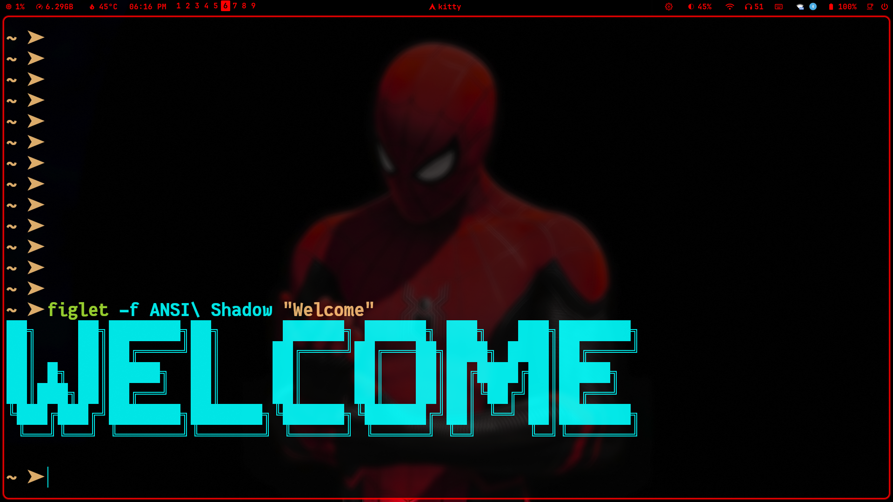

# Arch Linux Hyprland Project

## ✨ Auto clone and install

> [!CAUTION]
> If you are using FISH SHELL, DO NOT use this function. Clone and ran install.sh instead

- you can use this command to automatically clone the installer and ran the script for you
- NOTE: `curl` package is required before running this command

```bash
sh <(curl -L https://raw.githubusercontent.com/JaKooLit/Arch-Hyprland/main/auto-install.sh)
```

#### then
```sh
cd ~/
mkdir -p src
cd src
git clone https://github.com/ohm-vishwa/ohm-hyprland-dotfiles
cd ohm-hyprland-dotfiles
mv ~/.config/hypr ~/.config/hypr.bak
mv ~/.config/waybar ~/.config/waybar.bak
cp -r hypr waybar ~/.config/
```
### my config dependency
[Hyprland Plugins](https://hypr.land/plugins/)

- [Hypr Dynamic Cursor](https://github.com/VirtCode/hypr-dynamic-cursors)

- [Hypr Expo](https://github.com/hyprwm/hyprland-plugins/tree/main/hyprexpo)
```sh
sudo pacman -S hyprpm
```
```sh
hyprpm add https://github.com/hyprwm/hyprland-plugins
hyprpm add https://github.com/virtcode/hypr-dynamic-cursors
hyprpm update
hyprpm enable dynamic-cursors
hyprpm enable hyprexpo
```
check plugins
```sh
hyprpm list
```

## Keybinding related to waybar
```sh
bindd = $mainMod CTRL ALT, B, toggle waybar on/off, exec, pkill -SIGUSR1 waybar
bindd = $mainMod CTRL, B, waybar styles menu, exec, $scriptsDir/WaybarStyles.sh
bindd = $mainMod ALT, B, waybar layout menu, exec, $scriptsDir/WaybarLayout.sh
```

## Folder Structure
```sh
.
├── hypr
│   ├── animations
│   │   ├── 00-default.conf
│   │   ├── 01-default - v2.conf
│   │   ├── 03- Disable Animation.conf
│   │   ├── END-4.conf
│   │   ├── HYDE - default.conf
│   │   ├── HYDE - minimal-1.conf
│   │   ├── HYDE - minimal-2.conf
│   │   ├── HYDE - optimized.conf
│   │   ├── HYDE - Vertical.conf
│   │   ├── Mahaveer - me-1.conf
│   │   ├── Mahaveer - me-2.conf
│   │   ├── ML4W - classic.conf
│   │   ├── ML4W - dynamic.conf
│   │   ├── ML4W - fast.conf
│   │   ├── ML4W - high.conf
│   │   ├── ML4W - moving.conf
│   │   └── ML4W - standard.conf
│   ├── application-style.conf
│   ├── configs
│   │   ├── ENVariables.conf
│   │   ├── Keybinds.conf
│   │   ├── Laptops.conf
│   │   ├── Startup_Apps.conf
│   │   ├── SystemSettings.conf
│   │   ├── WindowRules.conf
│   │   ├── WindowRules-config-v3.conf
│   │   └── WindowRules-pre-53.conf
│   ├── hypridle.conf
│   ├── hyprland.conf
│   ├── hyprlock-2k.conf
│   ├── hyprlock.conf
│   ├── initial-boot.sh
│   ├── Monitor_Profiles
│   │   ├── default.conf
│   │   └── README
│   ├── monitors.conf
│   ├── scripts
│   │   ├── AirplaneMode.sh
│   │   ├── Animations.sh
│   │   ├── Battery.sh
│   │   ├── BrightnessKbd.sh
│   │   ├── Brightness.sh
│   │   ├── ChangeBlur.sh
│   │   ├── ChangeLayout.sh
│   │   ├── ClipManager.sh
│   │   ├── DarkLight.sh
│   │   ├── Distro_update.sh
│   │   ├── Dropterminal.sh
│   │   ├── GameMode.sh
│   │   ├── Hypridle.sh
│   │   ├── Hyprsunset.sh
│   │   ├── KeybindsLayoutInit.sh
│   │   ├── keybinds_parser.py
│   │   ├── KeyBinds.sh
│   │   ├── KeyboardLayout.sh
│   │   ├── KeyHints.sh
│   │   ├── KillActiveProcess.sh
│   │   ├── Kitty_themes.sh
│   │   ├── Kool_Quick_Settings.sh
│   │   ├── KooLsDotsUpdate.sh
│   │   ├── LockScreen.sh
│   │   ├── MediaCtrl.sh
│   │   ├── MonitorProfiles.sh
│   │   ├── OverviewToggle.sh
│   │   ├── Polkit-NixOS.sh
│   │   ├── Polkit.sh
│   │   ├── PortalHyprland.sh
│   │   ├── RefreshNoWaybar.sh
│   │   ├── Refresh.sh
│   │   ├── RofiEmoji.sh
│   │   ├── RofiSearch.sh
│   │   ├── RofiThemeSelector-modified.sh
│   │   ├── RofiThemeSelector.sh
│   │   ├── ScreenShot.sh
│   │   ├── sddm_wallpaper.sh
│   │   ├── Sounds.sh
│   │   ├── Tak0-Autodispatch.sh
│   │   ├── Tak0-Per-Window-Switch.sh
│   │   ├── ThemeChanger.sh
│   │   ├── TouchPad.sh
│   │   ├── update_WindowRules.sh
│   │   ├── UptimeNixOS.sh
│   │   ├── UserConfigsSwitcher.sh
│   │   ├── Volume.sh
│   │   ├── WallustSwww.sh
│   │   ├── WaybarCava.sh
│   │   ├── WaybarLayout.sh
│   │   ├── WaybarScripts.sh
│   │   ├── WaybarStyles.sh
│   │   └── Wlogout.sh
│   ├── UserConfigs
│   │   ├── 00-Readme
│   │   ├── 01-UserDefaults.conf
│   │   ├── ENVariables.conf
│   │   ├── LaptopDisplay.conf
│   │   ├── Laptops.conf
│   │   ├── Startup_Apps.conf
│   │   ├── UserAnimations.conf
│   │   ├── UserDecorations.conf
│   │   ├── UserKeybinds.conf
│   │   ├── UserSettings.conf
│   │   ├── WindowRules.conf
│   │   └── WorkSpaceRules.conf
│   ├── UserScripts
│   │   ├── 00-Readme
│   │   ├── RainbowBorders.sh.bak
│   │   ├── RofiBeats.sh
│   │   ├── RofiCalc.sh
│   │   ├── Tak0-Autodispatch.sh
│   │   ├── WallpaperAutoChange.sh
│   │   ├── WallpaperEffects.sh
│   │   ├── WallpaperRandom.sh
│   │   ├── WallpaperSelect.sh
│   │   ├── Weather.py
│   │   ├── Weather.sh
│   │   ├── WeatherWrap.sh
│   │   └── ZshChangeTheme.sh
│   ├── v2.3.20
│   ├── wallpaper_effects
│   ├── wallust
│   │   └── wallust-hyprland.conf
│   └── workspaces.conf
└── waybar
    ├── config -> /home/ohm/.config/waybar/configs/ohms
    ├── configs
    │   ├── [BOT] Camellia
    │   ├── [BOT] Chrysanthemum
    │   ├── [BOT] Default
    │   ├── [BOT] Default Laptop
    │   ├── [BOT] Gardenia
    │   ├── [BOT & Left] SouthWest
    │   ├── [BOT] Peony
    │   ├── [BOT & Right] SouthEast
    │   ├── [BOT] Simple
    │   ├── [BOT] Sleek
    │   ├── [LEFT] WestWing
    │   ├── [LEFT] WestWing v2
    │   ├── ohms
    │   ├── [RIGHT] EastWing
    │   ├── [RIGHT] EastWing v2
    │   ├── [TOP] 0-Ja-0
    │   ├── [TOP] Arrow
    │   ├── [TOP & BOT] SummitSplit
    │   ├── [TOP & BOT] SummitSplit-glass
    │   ├── [TOP & BOT] SummitSplit v2
    │   ├── [TOP & BOT] SummitSplit v3
    │   ├── [TOP] Camellia
    │   ├── [TOP] Chrysanthemum
    │   ├── [TOP] Default
    │   ├── [TOP] Default Laptop
    │   ├── [TOP] Default Laptop-glass
    │   ├── [TOP] Default Laptop (old v1)
    │   ├── [TOP] Default Laptop (old v2)
    │   ├── [TOP] Default Laptop (old v3)
    │   ├── [TOP] Default Laptop (old v4)
    │   ├── [TOP] Default Laptop (old v5)
    │   ├── [TOP] Default (old v1)
    │   ├── [TOP] Default (old v2)
    │   ├── [TOP] Default (old v3)
    │   ├── [TOP] Default (old v4)
    │   ├── [TOP] Everforest
    │   ├── [TOP] Everforest-glass
    │   ├── [TOP] Gardenia
    │   ├── [TOP & Left] NorthWest
    │   ├── [TOP] Minimal - Long
    │   ├── [TOP] Minimal - Short
    │   ├── [TOP] Peony
    │   ├── [TOP & Right] NorthEast
    │   ├── [TOP] Simple
    │   ├── [TOP] Simpliest
    │   └── [TOP] Sleek
    ├── Modules
    ├── ModulesCustom
    ├── ModulesGroups
    ├── ModulesVertical
    ├── ModulesWorkspaces
    ├── style
    │   ├── [0 VERTICAL] [Catpuccin] Mocha.css
    │   ├── [0 VERTICAL] Golden Noir.css
    │   ├── [0 VERTICAL] Oglo Chicklets.css
    │   ├── [Black & White] Monochrome.css
    │   ├── [Catppuccin] Frappe.css
    │   ├── [Catppuccin] Latte.css
    │   ├── [Catppuccin] Mocha.css
    │   ├── catppuccin-themes
    │   │   ├── frappe.css
    │   │   ├── latte.css
    │   │   ├── mocha.css
    │   │   └── rgbmocha.css
    │   ├── [Colored] Chroma Glow.css
    │   ├── [Colored] Translucent.css
    │   ├── [Colorful] Aurora Blossom.css
    │   ├── [Colorful] Aurora.css
    │   ├── [Colorful] Oglo Chicklets.css
    │   ├── [Colorful] Rainbow Spectrum.css
    │   ├── [Colorful] stolen-style.css
    │   ├── Crystal Clear Glass.css
    │   ├── [Dark] Golden Eclipse.css
    │   ├── [Dark] Golden Noir.css
    │   ├── [Dark] Half-Moon.css
    │   ├── [Dark] Latte-Wallust combined.css
    │   ├── [Dark] Latte-Wallust combined v2.css
    │   ├── [Dark] Purpl.css
    │   ├── [Dark] Wallust Obsidian Edge.css
    │   ├── [Extra] Arrow.css
    │   ├── [Extra] Crimson.css
    │   ├── [Extra] EverForest.css
    │   ├── [Extra] Mauve.css
    │   ├── [Extra] ML4W starter.css
    │   ├── [Extra] Modern-Combined.css
    │   ├── [Extra] Modern-Combined - Transparent.css
    │   ├── [Extra] Neon Circuit.css
    │   ├── [Extra] Prismatic Glow.css
    │   ├── [Extra] Rose Pine.css
    │   ├── [Extra] Simple Pink.css
    │   ├── [Light] Monochrome Contrast.css
    │   ├── [Light] Obsidian Glow.css
    │   ├── ML4W
    │   │   └── glass.css
    │   ├── ML4W Glass-3d.css
    │   ├── ML4W Glass.css
    │   ├── ohm-red.css
    │   ├── ohms-cyan.css
    │   ├── [Rainbow] RGB Bordered.css
    │   ├── [Retro] Simple Style.css
    │   ├── [Transparent] Crystal Clear.css
    │   ├── [VERTICAL] [Catpuccin] Mocha.css
    │   ├── [Wallust Bordered] Chroma Fusion Edge.css
    │   ├── [Wallust Bordered] Chroma Simple.css
    │   ├── [Wallust] Box type.css
    │   ├── [Wallust] Chroma Edge.css
    │   ├── [Wallust] Chroma Fusion.css
    │   ├── [Wallust] Chroma Tally.css
    │   ├── [Wallust] Chroma Tally V2.css
    │   ├── [Wallust] Colored.css
    │   ├── [WALLUST] ML4W-modern.css
    │   ├── [WALLUST] ML4W-modern-mixed.css
    │   ├── [Wallust] Simple.css
    │   └── [Wallust Transparent] Crystal Clear.css
    ├── style.css -> /home/ohm/.config/waybar/style/ohm-red.css
    ├── UserModules
    └── wallust
        └── colors-waybar.css
```
Credit to [JaKooLit](https://github.com/JaKooLit)
